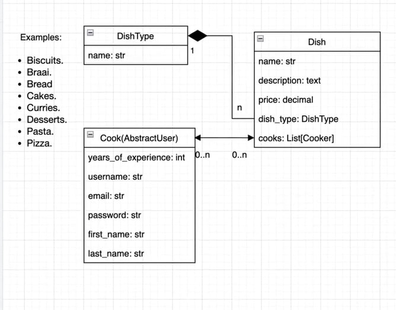

# Restaurant kitchen

### Description:

An example of a REST WebServer developed using Django(MVT).

This application describes the operation of the kitchen,
where the manager can add dishes, ingredients and cooks.

- Main idea to create application is to show knowledge of Django, Python Core, as well as REST architectural style.
- Each user must login in order to access application.

### Check it out!

[Kitchen project deployed to Render](https://restaurant-kitchen-ldjd.onrender.com)
- login: admin
- password: 123

### How to install the project

Python3 must be already installed

1. Use the git clone command to clone the repository.

```
git clone repository_url
```

2. Go to the project directory.

```angular2html
cd restaurant-kitchen
```

3. Create and activate a virtual environment:

```angular2html
python -m venv venv
```

for Windows:

```angular2html
.\venv\Scripts\activate
```

for Linux/Mac:

```angular2html
source venv/bin/activate
```

4. Use pip to install the requirements.

```angular2html
pip install -r requirements.txt
```

5. Apply the migrations.

```angular2html
python manage.py migrate
```

6. Create superuser

```
python manage.py createsuperuser
```

8. Run the Django development server.

```
python manage.py runserver

```

### Technologies:

- Python 3.12.1
- SQLite, PostgreSQL databases
- Django 4.1.0 (MVT, Session, Forms, Tests)


Project diagram:

